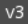

#  Godot Auto Export Version

Ever wanted to display the current version of your game somewhere? You did, but you don't have idea what to display or you forget to update it every time? This plugin is for you.

Every time you export the project, `application/config/version` project setting will be updated. Use this setting anywhere to display the version. Now your version automatically updates and you don't need to remember to update your scenes.

## Plugin setup

After you enable the plugin, go to Project Settings and configure it at `addons/ExportAutoVersion` section (advanced mode).
- `Version Store Location` - Defines where the version will be stored. By default the version is stored in a project setting, but can be also in a script file that you can preload.
- `Version File Path` - If you use the script store option, this defines where the script will be located.
- `Version Setting Name` - If you use Project Settings store option, the version will be stored under this setting.
- `Version Config File` - Script for version configuration. It extends `VersionProvider.gd`. The file is automatically created when you enable the addon for the first time, modify this setting to move the file somewhere else.

The last thing to do is to implement `get_version()` method in the version config file (`res://auto_export_version_config_file.gd` by default). It should return a String from some external source that contains your current version. A few "version providers" are included by default:
- Git version (`get_git_commit_count()`) - If your project is inside git repository, the plugin will fetch the number of commits and use it as current version.
- Git branch version (`get_git_branch_name()`) - If your project is inside git repository, the plugin will fetch the current branch's name.
- Git hash version (`get_git_commit_hash()`) -  If your project is inside git repository, the plugin will fetch the latest commit's hash.
- Profile version (`get_export_preset_version()`) - If you have export presets that contain some version string (e.g. for Android), this will fetch the version from that profile. Normally it's not possible to display this version in the project, hence the plugin is useful.
- Android version (`get_export_preset_android_version_code()`, `get_export_preset_android_version_name()`) - same as above, but specialized for Android. Instead of version field, it uses both version code and version name and you can customize what format is used to display it.

To use any of these providers just uncomment the line starting with `#`. All of them are methods that return a String, so you can combine them to your liking. Or you can write a custom one (also if you have some good idea, you can open an issue and it might be officially included with this plugin; the plugin originally started with only 2 providers).

## How to use the version

After each project export, the plugin will update the version project setting, or `version.gd` file depending on configuration.

Example for using the setting:
```GDScript
extends Label

func _ready():
	text = "v%s" % ProjectSettings.get_setting("application/config/version")
```
Attach it to any Label and it will display the current version and auto-update after each project export. Now you can forget about it, because it's all automatic.



If you use the script version location, the code will be instead:
```GDScript
extends Label

func _ready():
	text = "v%s" % load("res://version.gd").VERSION
```

If you want to print/update the current version without exporting the project, you can use the option in Project -> Tools menu called 'Print and Update Current Version'. This will display the version and update it as if the export was started.

Special thanks to [@Kubulambula](https://github.com/Kubulambula) for refactoring the plugin and porting it to Godot 4.0.

___
You can find all my addons on my [profile page](https://github.com/KoBeWi).

<a href='https://ko-fi.com/W7W7AD4W4' target='_blank'></a>
